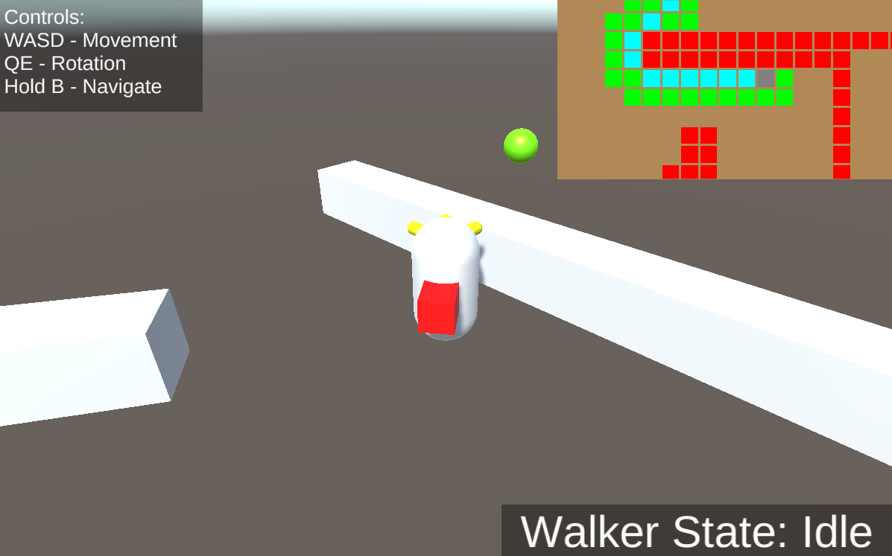

# Indoor Navigation Simulator

This is a 3D simulation for the 2023 Rolling Robots Inventeam project!

## Preview

Features:
* Simulated LiDAR, Bluetooth, Distance (Infrared/Ultrasonic) sensors
* A* navigation algorithm taking input from LiDAR for obstacle locataion
* UI to display 2D map of relevant components

## How to Run

Visit https://adewinmbi.github.io/indoor-navigation-website/
